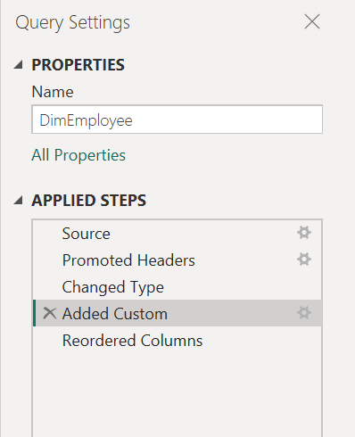
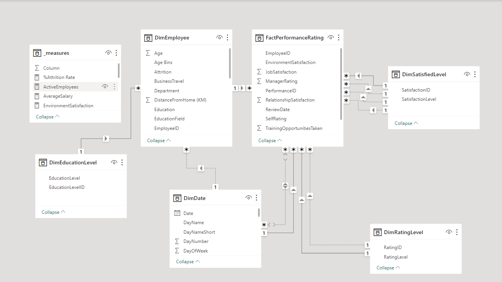
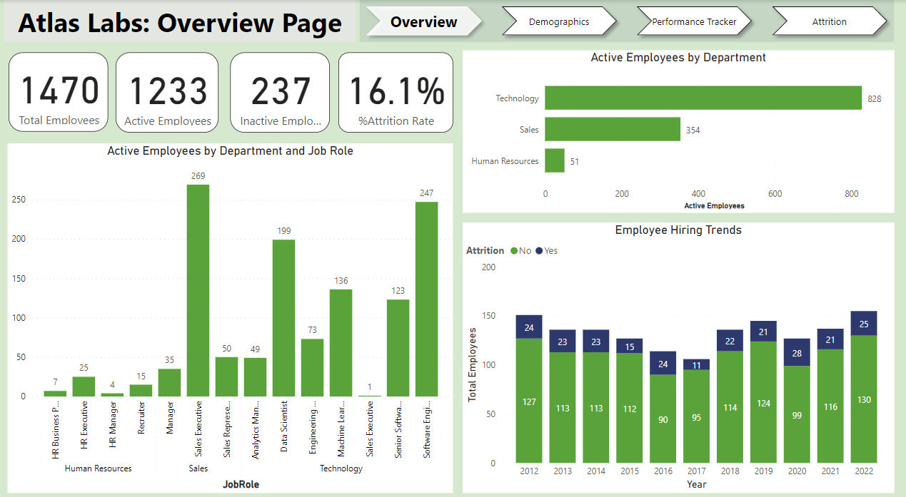
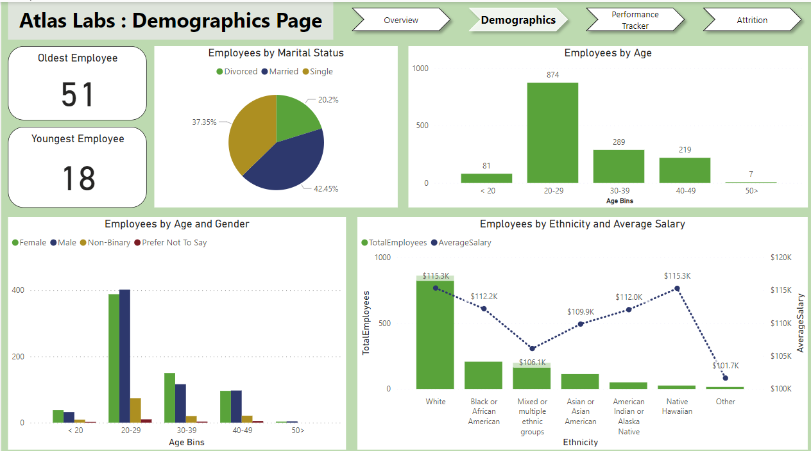
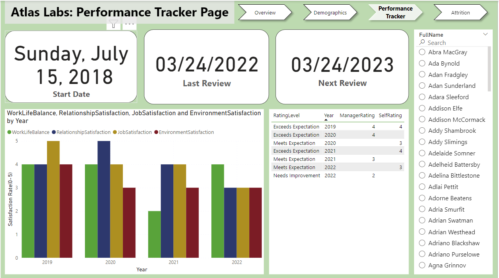
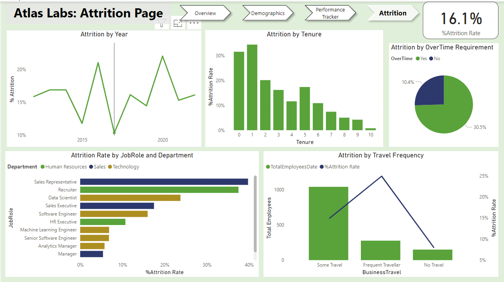

# HR-Analytics
This is a Power BI case study, we explore a dataset for a fictitious software company called Atlas Labs. The analysis delves into attrition and the factors influencing it, helping Atlas Labs determine actions to retain more employees.

# Introduction
In this Power BI case study, we explore a dataset for a fictitious software company called Atlas Labs. The focus is on importing, analyzing, and visualizing Human Resources data in Power BI. We conducted exploratory data analysis and used DAX to build powerful visualizations. The analysis delves into attrition and the factors influencing it, helping Atlas Labs determine actions to retain more employees.

Attrition, in an HR context, refers to the reduction of staff numbers through resignation, retirement, or death, rather than through layoffs. High attrition rates can indicate underlying issues within an organization that need addressing to improve employee retention.

## Problem Statement
Atlas Labs seeks a report to enhance their HR analytics, focusing on diversity and inclusion, employee performance, and demographics, as well as identifying factors influencing attrition.

## Skills Demonstrated
- Data Modeling in Power BI
- DAX (Data Analysis Expressions) in Power BI
- Data Visualization
- Exploratory Data Analysis
- Dashboard Creation
- Creating Reporting

## Data Sourcing
The data, provided by DataCamp, consists of five tables:
1. **Performance Rating**: 6709 rows, 11 columns
2. **Employee**: 1470 rows, 23 columns
3. **Education Level**: 5 rows, 2 columns
4. **Rating Level**: 5 rows, 2 columns
5. **Satisfied Level**: 5 rows, 2 columns

## Data Transformation
The dataset required minimal transformations to ensure readiness for analysis. The key change made was adding a custom column AgeBins in the Employee table for demographics analysis.

## Modeling
Data modeling is a crucial step in Power BI report development as it connects different data tables in star or snowflake schemas. In this case, a *star schema* is used. The schema centers around the FactPerformanceRating table, which stores key performance metrics. Surrounding dimension tables (DimEmployee, DimEducationLevel, DimDate, DimSatisfiedLevel, and DimRatingLevel) provide contextual information, enabling detailed data analysis and efficient reporting.

## Atlas Labs Report
Based on the problem statements, here is the analysis for Atlas Labs. The report consists of four pages. 

Let’s explore the key findings:

### Key Findings
The overview dashboard provides insights into employee metrics at Atlas Labs, including total employees, active and inactive employees, attrition rates, departmental distribution, job role distribution, and hiring trends.

1. **Summary Metrics:**
   - **Total Employees:** 1470
   - **Active Employees:** 1233
   - **Inactive Employees:** 237
   - **Attrition Rate:** 16.1%

2. **Active Employees by Department:**
   - **Technology:** 828 employees
   - **Sales:** 354 employees
   - **Human Resources:** 51 employees

3. **Active Employees by Department and Job Role:**
   - **Human Resources:**
     - HR Business Partner: 7
     - HR Executive: 25
     - HR Manager: 4
     - Recruiter: 15
   - **Sales:**
     - Manager: 35
     - Sales Executive: 269
     - Sales Representative: 50
   - **Technology:**
     - Analytics Manager: 49
     - Data Scientist: 199
     - Engineering Manager: 73
     - Machine Learning Engineer: 1
     - Sales Executive: 136
     - Senior Software Engineer: 123
     - Software Engineer: 247

4. **Employee Hiring Trends (2012-2022):**
   - **2012:** 151 employees hired (127 active, 24 attrition)
   - **2013:** 136 employees hired (113 active, 23 attrition)
   - **2014:** 138 employees hired (113 active, 23 attrition)
   - **2015:** 128 employees hired (113 active, 15 attrition)
   - **2016:** 114 employees hired (90 active, 24 attrition)
   - **2017:** 106 employees hired (95 active, 11 attrition)
   - **2018:** 136 employees hired (114 active, 22 attrition)
   - **2019:** 149 employees hired (121 active, 28 attrition)
   - **2020:** 127 employees hired (99 active, 28 attrition)
   - **2021:** 151 employees hired (130 active, 21 attrition)
   - **2022:** 155 employees hired (130 active, 25 attrition)

## Key Observations
- **High Concentration in Technology and Sales:** The majority of active employees are in the Technology (828) and Sales (354) departments.
- **Job Role Distribution:** In the Technology department, Software Engineers and Data Scientists constitute significant portions, with 247 and 199 employees respectively. In Sales, Sales Executives (269) are the most common role.
- **Steady Hiring with Some Attrition:** The company has consistently hired over the years, with a noticeable attrition rate each year, impacting the total number of active employees.

## Conclusion
The dashboards provide a comprehensive overview of Atlas Labs' workforce. Key insights include a significant concentration of employees in the Technology and Sales departments, a diverse distribution of job roles within these departments, and a consistent hiring trend over the past decade. The attrition rate stands at 16.1%, indicating that while the company is successfully attracting new talent, retaining them remains a challenge.

## Recommendations
1. **Enhance Retention Strategies:**
   - **Employee Engagement:** Implement regular engagement surveys to identify and address concerns.
   - **Career Development:** Offer clear career progression paths and continuous learning opportunities to keep employees motivated.
   - **Work-Life Balance:** Promote policies that support work-life balance, such as flexible working hours and remote work options.

2. **Focus on High Attrition Areas:**
   - **Technology and Sales Departments:** Given the high concentration of employees in these areas, focus retention efforts here. Tailor retention strategies specific to these departments' needs and challenges.

3. **Talent Acquisition:**
   - **Quality over Quantity:** Focus on hiring not just in large numbers but also on finding the right fit for the company's culture and long-term goals.
   - **Diverse Recruitment:** Ensure a diverse hiring pipeline to bring varied perspectives and ideas into the company.

4. **Data-Driven Decisions:**
   - **Regular Analysis:** Continuously monitor workforce metrics and adjust strategies based on data-driven insights.
   - **Attrition Analysis:** Conduct a deeper analysis of the reasons behind attrition to develop targeted interventions.

5. **Employee Well-being:**
   - **Health Programs:** Implement wellness programs and mental health support to improve overall employee well-being.
   - **Recognition and Rewards:** Establish recognition programs to reward high performance and encourage employee loyalty.

By addressing these recommendations, Atlas Labs can improve employee retention, foster a more engaged workforce, and maintain its competitive edge in the industry.

### Contact
For more insights and updates, follow me on ([https://twitter.com](https://x.com/SJaelhard)) or connect with me on(https://www.linkedin.com/in/susan-wanjiku-4a9599259/).

